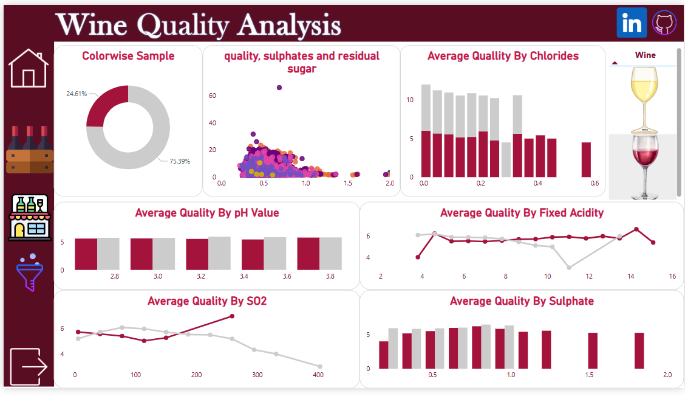

# 🍷 Wine Quality Analysis Dashboard

## 🎯 Objective

To build an *interactive and visually engaging Power BI dashboard* that analyzes wine quality based on various chemical properties, offering insights into what factors contribute most to high or low wine quality.

---

## 🧰 Tools Used

- *Power BI Desktop*
- *Wine Quality Dataset* (Red and White wines)
- *DAX Calculations*
- *Power BI Visuals*:
  - Donut Chart
  - Bar Charts
  - Line Charts
  - Scatter Plot
  - Icons & Image Assets

---

## 🪜 Dashboard Development Steps

### 1️⃣ Load and Prepare Data

- Import CSV files (red and white wine datasets) using Get Data → Text/CSV
- Combine datasets and add a "Wine Color" column
- Ensure correct data types (numeric for chemical properties, categorical for wine type)

### 2️⃣ Data Cleaning & Transformation

- Handle missing or null values
- Rename columns for clarity (e.g., fixed_acidity, volatile_acidity)
- Create DAX measures like Average Quality, Total SO2, etc.

### 3️⃣ Create Visuals and Insights

*Dashboard Sections:*

- *📊 Colorwise Sample Distribution*
  - Donut chart showing red (24.61%) vs white (75.39%) wine ratio

- *🔬 Quality vs Sulphates and Residual Sugar*
  - Scatter plot visualizing the relationship between quality, sulphates, and sugar content

- *🧂 Average Quality by Chlorides*
  - Bar chart analyzing how chloride concentration affects quality

- *⚗ Average Quality by pH Value*
  - Bar chart showing consistency in average quality across various pH levels

- *🔥 Average Quality by Fixed Acidity*
  - Line chart comparing acidity impact on red vs white wine

- *🧪 Average Quality by SO2*
  - Line chart showing how sulfur dioxide concentration affects quality, distinctly for each wine type

- *🧂 Average Quality by Sulphates*
  - Bar chart revealing that higher sulphate levels generally boost wine quality

---

## 📌 Key Insights

- *White wines dominate the dataset* with over 75% share.
- *Higher sulphate levels* are often associated with *better quality scores*.
- *SO2 impacts red and white wines differently*, suggesting a need for tailored control.
- *pH levels* show little variation in quality, while *fixed acidity* has clearer trends.
- *Chloride levels* inversely affect quality beyond a certain point.

---

## ✅ Best Practices Applied

- Clean and minimal layout with side navigation icons
- Color-coded for wine type and ease of interpretation
- Strategic use of chart types for effective storytelling
- Slicer filters and logical layout improve user interactivity

---

## 🖼 Dashboard Preview

---

## 📁 Dataset Source

Wine Quality Datasets: [UCI Machine Learning Repository – Wine Quality Data Set]((https://www.kaggle.com/datasets/ruthgn/wine-quality-data-set-red-white-wine/data))
