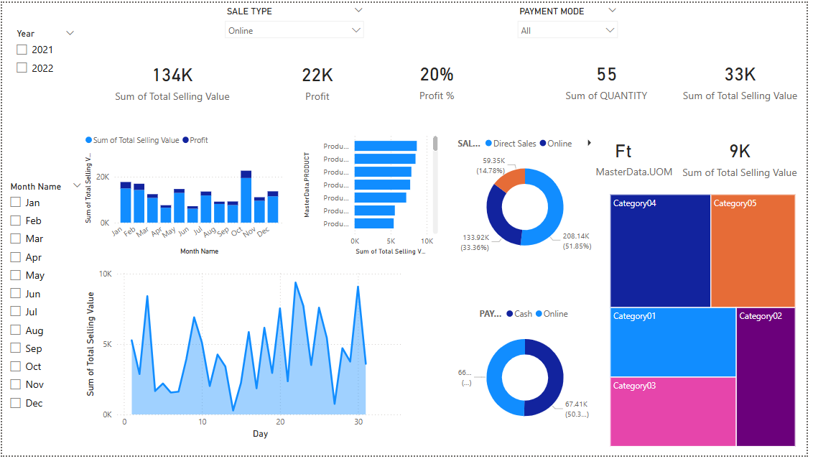

# Task 4: Dashboard Design
## Objective

Design an interactive dashboard using Power BI to visualize e-commerce sales data and deliver actionable business insights. The dashboard enables stakeholders to analyze performance through dynamic filters, KPIs, and time-series visuals.

---

## File Structure

```plaintext
Task4_Dashboard_Design/
├── README.md                 # This file
├── Dashboard_pic.png         # Screenshot of the finished dashboard
├── Task4_Summary.pptx        # PPT summary of dashboard insights
```

## Tools & Data
  - Tool: Power BI Desktop (Latest Version)
  - Language: DAX (Data Analysis Expressions)
  - Data Source: e_commerce_data.csv

## Dataset Fields
  - Order Date
  - Customer Name
  - Product
  - Category / Sub-Category
  - Amount
  - Profit
  - Quantity
  - Payment Mode
  - State

## Implementation Steps

### 1. Load Data
- In Power BI: `Home → Get Data → Text/CSV`
- Select `e_commerce_data.csv`
- Validate column data types:  
  - Date: `Order Date`  
  - Text: `Product`, `Category`, etc.  
  - Numeric: `Amount`, `Profit`, `Qty`

---

### 2. Data Preparation
- Open **Power Query Editor**
  - Remove blanks and errors
  - Rename columns for clarity (e.g., `Amount`, `Profit`, `Qty`)
  - Convert `Order Date` to **Date** type
- Click **Close & Apply**

---

### 3. Create Measures (DAX)

```DAX
Total Amount = SUM('e_commerce_data'[Amount])
Total Profit = SUM('e_commerce_data'[Profit])
Total Quantity = SUM('e_commerce_data'[Qty])
Avg Order Value = DIVIDE([Total Amount], [Total Quantity], 0)
```

---

##  Dashboard Design



### Key Features

| Feature                | Description                                                |
|------------------------|------------------------------------------------------------|
| KPI Cards           | Total Amount, Profit, Quantity Sold, Avg Order Value       |
| Time-Series Analysis| Monthly & Daily sales using column and line charts         |
| Product & Category  | Bar chart and Treemap for performance by item/category     |
| Filters/Slicers    | Year, Month, Sale Type, Payment Mode                        |
| Donut Charts        | Sales type & payment method distribution                   |
| Geographic View    | Sales by State (horizontal bar chart)                      |
| Visual Consistency | Blue & orange theme, tooltips, clean layout                |
| Interactivity       | Slicers, hover effects, bookmarks for Q1–Q4 navigation     |

---

## Navigation & Filters

- **Year/Month Slicers**: Time-based drilldowns  
- **Sale Type / Payment Mode Filters**: Behavioral insights  
- **Hover Effects**: Show tooltips with detailed data  
- **Bookmarks**: Navigate across Q1, Q2, Q3, Q4 views  

---

## Key Insights from Screenshot

- **Total Sales**: `134K`  
- **Profit**: `22K`  
- **Profit %**: `20%`  
- **Quantity Sold**: `55 Units`  
- **Sales Type**: Online leads with `51.85%` share  
- **Payment Preference**: Roughly split between **Online** and **Cash**  
- **Top Categories**: `Category04` and `Category05` perform best  

---

## Formatting & Best Practices

- High-contrast theme for clarity  
- Font: **Segoe UI** for consistency  
- Tooltips on visuals for accessibility  
- Clean, minimal layout  
- Dark background with accent chart colors  

---

## Deliverables

- `Dashboard_pic.png` — Visual snapshot of the dashboard  
- `Task4_Summary.pptx` — Presentation with key findings and visuals  
- `README.md` — Documentation file (this file)

---
